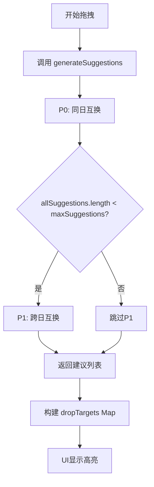

# 调课功能缺陷修复计划

## 问题概述

### 缺陷1：跨日调课建议不显示

**现象描述：**
- 当天只有1节课时，拖拽该课程，跨日调课建议（蓝色高亮）没有显示
- 当天有2节课时，拖拽其中一节，跨日调课建议才能正常显示

**根本原因分析：**

经过深入分析 [`generateSuggestions`](src/algorithms/adjustment/index.ts:125) 方法，发现问题可能出在以下几个环节：



**可能的问题点：**

1. **P1执行条件问题** - 在 [`index.ts:144`](src/algorithms/adjustment/index.ts:144)：
   ```typescript
   if (this.config.enableP1 && allSuggestions.length < this.config.maxSuggestions)
   ```
   如果 P0 返回的建议数量已经达到 `maxSuggestions`（默认5），P1 就不会被执行。

2. **dropTargets 构建逻辑问题** - 在 [`scheduleStore.ts:334-357`](src/stores/scheduleStore.ts:334)：
   ```typescript
   for (const suggestion of suggestions) {
     const targetOp = suggestion.operations.find(op => op.cellId === cell.id)
     if (targetOp && targetOp.toSlot) {
       // 只有当找到匹配的操作时才添加到 dropTargets
     }
   }
   ```
   如果 operations 中的 cellId 不匹配，建议就不会被添加到 dropTargets。

3. **数据层面问题** - `classCells` 可能不包含其他天的课程数据。

### 缺陷2：灰色位置不显示不可调课原因

**现象描述：**
- 当拖拽到不可调课的位置时，只显示灰色，没有说明具体原因

**需求：**
- 在灰色目标位置显示不能调课的原因（规则限制说明）

---

## 修复方案

### 方案1：诊断和修复跨日调课问题

#### 步骤1：添加调试日志

在以下位置添加详细的调试日志：

1. [`generateSuggestions`](src/algorithms/adjustment/index.ts:125) 方法开始处
2. P0 执行后，记录返回的建议数量
3. P1 执行条件判断处
4. P1 返回的建议数量
5. [`startDrag`](src/stores/scheduleStore.ts:312) 中 dropTargets 构建过程

#### 步骤2：根据日志结果修复问题

**可能的修复方向：**

A. 如果 P1 根本没有被执行：
   - 修改执行条件，确保 P1 总是被执行（不受 P0 结果数量限制）
   - 或者增加 `maxSuggestions` 的值

B. 如果 P1 执行了但返回空数组：
   - 检查 [`findCrossDaySwaps`](src/algorithms/adjustment/p1CrossDaySwap.ts:29) 的过滤条件
   - 检查 [`canCrossDaySwap`](src/algorithms/adjustment/p1CrossDaySwap.ts:98) 的验证逻辑
   - 检查 `classCells` 数据是否正确

C. 如果 P1 返回了建议但 dropTargets 为空：
   - 检查 operations 中的 cellId 是否正确
   - 检查 toSlot 是否正确设置

### 方案2：显示不可调课原因

#### 实现思路

1. **扩展 DropTargetInfo 接口**（已完成）
   - `violations: string[]` - 存储规则违反信息

2. **计算所有位置的调课可行性**
   - 不仅计算可行的位置，还要计算不可行位置的原因
   - 在 [`startDrag`](src/stores/scheduleStore.ts:312) 中，遍历所有可能的格子

3. **UI 显示**
   - 修改 [`DropTargetCell`](src/components/Schedule/DropTargetCell.tsx) 组件
   - 添加悬浮提示显示不可调课原因
   - 或者在格子内直接显示简短原因

#### 具体实现

```typescript
// 在 startDrag 中计算所有位置（包括不可行的）
const allSlots = []
for (let day = 1; day <= 5; day++) {
  for (let period = 1; period <= 8; period++) {
    const slotKey = `${day}_${period}`
    // 检查该位置的可行性
    const feasibility = checkSlotFeasibility(cell, day, period, engine)
    allSlots.push({
      cellId: slotKey,
      dayOfWeek: day,
      period: period,
      ...feasibility
    })
  }
}
```

---

## 实施计划

### Phase 1：诊断跨日调课问题
- [ ] 在 `generateSuggestions` 添加调试日志
- [ ] 在 `startDrag` 添加调试日志
- [ ] 在浏览器控制台观察日志输出
- [ ] 确定问题发生的具体环节

### Phase 2：修复跨日调课问题
- [ ] 根据诊断结果实施修复
- [ ] 测试当天只有1节课的场景
- [ ] 测试当天有多节课的场景

### Phase 3：实现不可调课原因显示
- [ ] 创建 `checkSlotFeasibility` 函数
- [ ] 修改 `startDrag` 计算所有位置
- [ ] 修改 `DropTargetCell` 显示原因
- [ ] 添加样式和交互

### Phase 4：测试验证
- [ ] 端到端测试所有场景
- [ ] 验证修复效果

---

## 关键代码位置

| 文件 | 行号 | 说明 |
|------|------|------|
| [`index.ts`](src/algorithms/adjustment/index.ts:125) | 125-174 | generateSuggestions 方法 |
| [`index.ts`](src/algorithms/adjustment/index.ts:144) | 144 | P1 执行条件 |
| [`p1CrossDaySwap.ts`](src/algorithms/adjustment/p1CrossDaySwap.ts:29) | 29-93 | findCrossDaySwaps 函数 |
| [`p1CrossDaySwap.ts`](src/algorithms/adjustment/p1CrossDaySwap.ts:98) | 98-144 | canCrossDaySwap 函数 |
| [`scheduleStore.ts`](src/stores/scheduleStore.ts:312) | 312-364 | startDrag 方法 |
| [`scheduleStore.ts`](src/stores/scheduleStore.ts:334) | 334-357 | dropTargets 构建逻辑 |
| [`DropTargetCell.tsx`](src/components/Schedule/DropTargetCell.tsx) | - | 放置目标单元格组件 |
