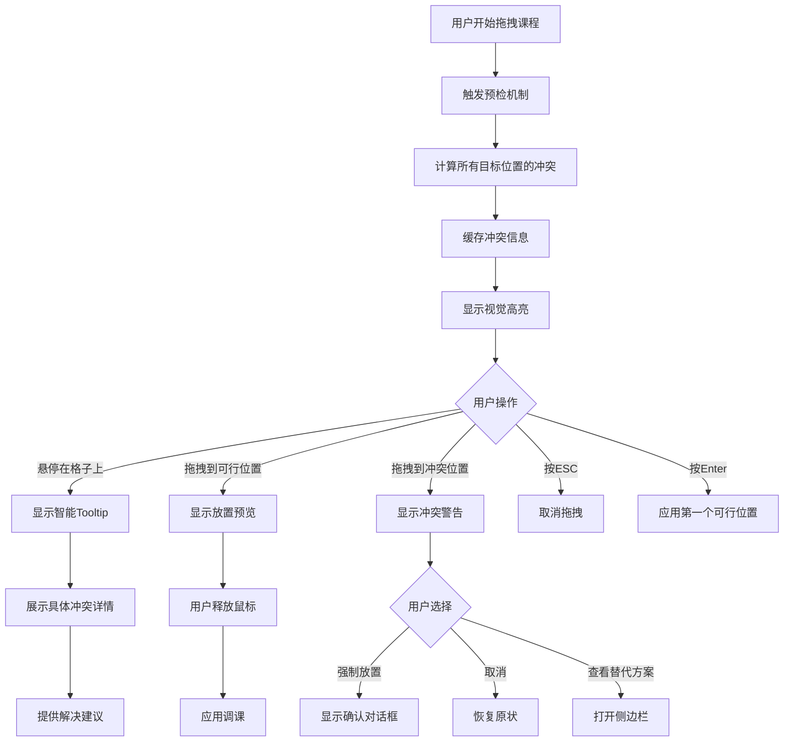
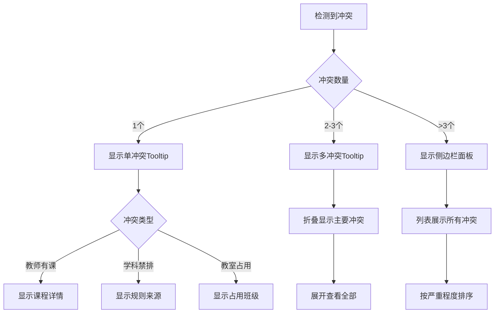

# 拖拽调课冲突提示优化方案

## 1. 问题分析

### 1.1 当前实现的问题

通过代码分析，发现当前冲突提示存在以下问题：

| 问题 | 现状 | 影响 |
|------|------|------|
| **信息笼统** | 只显示"教师不可用"、"教师时间冲突" | 用户无法了解具体原因 |
| **缺乏指导** | 没有告诉用户如何解决 | 用户需要自行摸索 |
| **遮挡视线** | 冲突原因直接显示在格子内 | 影响课表可读性 |
| **数据缺失** | `violations`只存储错误码 | 无法提供具体冲突详情 |

### 1.2 现有代码结构

```
冲突提示相关文件：
├── src/components/Schedule/DropTargetCell.tsx  # 渲染冲突提示
├── src/stores/scheduleStore.ts                 # DropTargetInfo 数据结构
├── src/types/adjustment.types.ts               # AdjustmentSuggestion 类型
└── src/algorithms/adjustment/                  # 生成冲突信息的算法
    ├── index.ts
    ├── p0SameDaySwap.ts
    ├── p1CrossDaySwap.ts
    └── p2Substitute.ts
```

---

## 2. 信息具体化方案

### 2.1 冲突详情数据结构

扩展现有的 `violations` 从简单字符串数组改为结构化对象：

```typescript
// src/types/adjustment.types.ts

/**
 * 冲突类型枚举
 */
export enum ConflictType {
  TeacherBusy = 'teacher_busy',           // 教师有课
  TeacherUnavailable = 'teacher_unavailable', // 教师不可用时段
  SubjectForbidden = 'subject_forbidden', // 学科禁排时段
  RoomOccupied = 'room_occupied',         // 教室被占用
  FixedCourse = 'fixed_course',           // 固定课程
  SameCell = 'same_cell',                 // 原位置
}

/**
 * 冲突详情 - 结构化信息
 */
export interface ConflictDetail {
  type: ConflictType                      // 冲突类型
  severity: 'error' | 'warning' | 'info' // 严重程度
  message: string                         // 简短描述
  details: ConflictDetails               // 具体详情
  suggestion?: string                     // 解决建议
}

/**
 * 冲突具体详情 - 根据类型不同有不同字段
 */
export type ConflictDetails = 
  | TeacherBusyDetails
  | TeacherUnavailableDetails
  | SubjectForbiddenDetails
  | RoomOccupiedDetails
  | FixedCourseDetails

// 教师有课详情
export interface TeacherBusyDetails {
  teacherId: string
  teacherName: string
  busySlot: {
    dayOfWeek: number
    period: number
    dayName: string      // "周一"
    periodName: string   // "第3节"
  }
  busyWith: {
    className: string    // "三年二班"
    subject: string      // "数学"
  }
}

// 教师不可用时段详情
export interface TeacherUnavailableDetails {
  teacherId: string
  teacherName: string
  reason: string         // "开会"、"培训"等
  unavailableSlots: Array<{
    dayOfWeek: number
    period: number
    dayName: string
    periodName: string
  }>
}

// 学科禁排时段详情
export interface SubjectForbiddenDetails {
  subject: string
  subjectName: string
  forbiddenSlot: {
    dayOfWeek: number
    period: number
    dayName: string
    periodName: string
  }
  rule: string           // 规则来源："体育课不能排在上午前两节"
}

// 教室被占用详情
export interface RoomOccupiedDetails {
  roomId: string
  roomName: string
  occupiedBy: {
    className: string
    subject: string
    teacherName: string
  }
}

// 固定课程详情
export interface FixedCourseDetails {
  courseName: string
  reason: string         // "全校集会"、"期中考试"
}
```

### 2.2 更新 DropTargetInfo 接口

```typescript
// src/stores/scheduleStore.ts

export interface DropTargetInfo {
  cellId: string
  dayOfWeek: number
  period: number
  priority: AdjustmentPriority | null
  score: number
  isValid: boolean
  // 改进：从 string[] 改为结构化对象
  violations: ConflictDetail[]  // 之前是 string[]
  operations: ScheduleOperation[]
  impact?: AdjustmentImpact
  description?: string
}
```

### 2.3 冲突信息生成示例

在调课算法中生成具体冲突信息：

```typescript
// src/algorithms/adjustment/p0SameDaySwap.ts

// 当检测到教师冲突时
function generateTeacherConflictDetail(
  teacher: Teacher,
  busySlot: { dayOfWeek: number; period: number },
  busyWith: { className: string; subject: string }
): ConflictDetail {
  return {
    type: ConflictType.TeacherBusy,
    severity: 'error',
    message: `${teacher.name}此时段有课`,
    details: {
      teacherId: teacher.id,
      teacherName: teacher.name,
      busySlot: {
        dayOfWeek: busySlot.dayOfWeek,
        period: busySlot.period,
        dayName: DAY_NAMES[busySlot.dayOfWeek],
        periodName: `第${busySlot.period}节`
      },
      busyWith: {
        className: busyWith.className,
        subject: SUBJECT_NAMES[busyWith.subject]
      }
    },
    suggestion: `可尝试选择其他时段，或与${busyWith.className}协调调课`
  }
}
```

---

## 3. UI展示策略

### 3.1 三层展示架构

采用"渐进式披露"原则，分三层展示冲突信息：

```
┌─────────────────────────────────────────────────────────────┐
│                     第一层：即时反馈                          │
│  拖拽过程中实时显示 - 视觉高亮 + 简短标签                      │
├─────────────────────────────────────────────────────────────┤
│                     第二层：悬浮详情                          │
│  悬停/聚焦时显示 - 智能Tooltip卡片                            │
├─────────────────────────────────────────────────────────────┤
│                     第三层：完整面板                          │
│  点击查看更多 - 侧边栏/模态框                                 │
└─────────────────────────────────────────────────────────────┘
```

### 3.2 第一层：即时反馈（视觉高亮）

在拖拽过程中，通过颜色和图标快速传达信息：

```typescript
// 冲突类型对应的视觉样式
const CONFLICT_STYLES: Record<ConflictType, ConflictStyle> = {
  [ConflictType.TeacherBusy]: {
    bgColor: 'bg-red-50',
    borderColor: 'border-red-400',
    icon: '👤❌',
    pattern: 'dotted'      // 虚线边框
  },
  [ConflictType.SubjectForbidden]: {
    bgColor: 'bg-orange-50',
    borderColor: 'border-orange-400',
    icon: '📚🚫',
    pattern: 'dashed'
  },
  [ConflictType.RoomOccupied]: {
    bgColor: 'bg-yellow-50',
    borderColor: 'border-yellow-400',
    icon: '🏫⛔',
    pattern: 'solid'
  },
  // ...
}
```

**视觉效果示意**：

```
┌─────────────────────────────────────────────────────────────┐
│                     拖拽中的课表                              │
├─────────────────────────────────────────────────────────────┤
│                                                             │
│   ┌──────────┐  ┌──────────┐  ┌──────────┐  ┌──────────┐  │
│   │ 👤❌     │  │          │  │ 📚🚫     │  │ ✓P0     │  │
│   │ 张老师   │  │ [空白]   │  │ 体育课   │  │ 语文课   │  │
│   │ 有课     │  │          │  │ 禁排     │  │ 95分     │  │
│   └──────────┘  └──────────┘  └──────────┘  └──────────┘  │
│   ↑ 红色虚线     ↑ 灰色        ↑ 橙色虚线    ↑ 绿色实线      │
│                                                             │
└─────────────────────────────────────────────────────────────┘
```

### 3.3 第二层：智能Tooltip卡片

#### 3.3.1 Tooltip定位策略

为避免遮挡用户视线，采用**智能定位算法**：

```typescript
// src/components/Schedule/ConflictTooltip.tsx

interface TooltipPosition {
  x: number
  y: number
  placement: 'top' | 'bottom' | 'left' | 'right'
}

function calculateTooltipPosition(
  targetRect: DOMRect,
  tooltipSize: { width: number; height: number },
  viewport: { width: number; height: number },
  mousePosition: { x: number; y: number }
): TooltipPosition {
  const PADDING = 16
  const OFFSET = 8
  
  // 优先级：右下 > 左下 > 右上 > 左上
  // 根据鼠标位置和视口边界动态调整
  
  const placements = [
    { dir: 'right', condition: targetRect.right + tooltipSize.width + OFFSET < viewport.width },
    { dir: 'left', condition: targetRect.left - tooltipSize.width - OFFSET > 0 },
    { dir: 'bottom', condition: targetRect.bottom + tooltipSize.height + OFFSET < viewport.height },
    { dir: 'top', condition: targetRect.top - tooltipSize.height - OFFSET > 0 }
  ]
  
  // 选择第一个满足条件的位置
  for (const { dir, condition } of placements) {
    if (condition) {
      return calculatePosition(dir, targetRect, OFFSET)
    }
  }
  
  // 默认右下
  return calculatePosition('right', targetRect, OFFSET)
}
```

#### 3.3.2 Tooltip组件设计

```tsx
// src/components/Schedule/ConflictTooltip.tsx

interface ConflictTooltipProps {
  conflict: ConflictDetail
  position: { x: number; y: number }
  visible: boolean
  onClose?: () => void
}

export function ConflictTooltip({ conflict, position, visible }: ConflictTooltipProps) {
  if (!visible) return null
  
  const severityStyles = {
    error: 'border-red-400 bg-red-50',
    warning: 'border-orange-400 bg-orange-50',
    info: 'border-blue-400 bg-blue-50'
  }
  
  return (
    <div
      className={`
        fixed z-50 w-72 p-3 rounded-lg shadow-lg border-2
        animate-in fade-in-0 zoom-in-95 duration-200
        ${severityStyles[conflict.severity]}
      `}
      style={{ left: position.x, top: position.y }}
    >
      {/* 标题栏 */}
      <div className="flex items-center gap-2 mb-2">
        <ConflictIcon type={conflict.type} />
        <span className="font-medium text-gray-900">
          {conflict.message}
        </span>
      </div>
      
      {/* 具体详情 */}
      <ConflictDetails detail={conflict} />
      
      {/* 解决建议 */}
      {conflict.suggestion && (
        <div className="mt-2 pt-2 border-t border-gray-200">
          <div className="flex items-start gap-1.5 text-sm text-gray-600">
            <Lightbulb className="w-4 h-4 text-amber-500 mt-0.5" />
            <span>{conflict.suggestion}</span>
          </div>
        </div>
      )}
      
      {/* 快捷操作 */}
      <div className="mt-3 flex gap-2">
        <button className="text-xs px-2 py-1 bg-white border rounded hover:bg-gray-50">
          查看详情
        </button>
        <button className="text-xs px-2 py-1 bg-white border rounded hover:bg-gray-50">
          忽略
        </button>
      </div>
    </div>
  )
}
```

#### 3.3.3 不同冲突类型的详情展示

```tsx
// 根据冲突类型渲染不同的详情内容
function ConflictDetails({ detail }: { detail: ConflictDetail }) {
  switch (detail.type) {
    case ConflictType.TeacherBusy:
      const teacherBusy = detail.details as TeacherBusyDetails
      return (
        <div className="space-y-1.5 text-sm">
          <div className="flex items-center gap-2">
            <User className="w-4 h-4 text-gray-400" />
            <span>{teacherBusy.teacherName}</span>
          </div>
          <div className="flex items-center gap-2">
            <Clock className="w-4 h-4 text-gray-400" />
            <span>{teacherBusy.busySlot.dayName} {teacherBusy.busySlot.periodName}</span>
          </div>
          <div className="flex items-center gap-2">
            <BookOpen className="w-4 h-4 text-gray-400" />
            <span>正在给 <strong>{teacherBusy.busyWith.className}</strong> 上<strong>{teacherBusy.busyWith.subject}</strong></span>
          </div>
        </div>
      )
      
    case ConflictType.SubjectForbidden:
      const subjectForbidden = detail.details as SubjectForbiddenDetails
      return (
        <div className="space-y-1.5 text-sm">
          <div className="flex items-center gap-2">
            <Book className="w-4 h-4 text-gray-400" />
            <span>{subjectForbidden.subjectName}</span>
          </div>
          <div className="flex items-center gap-2">
            <Clock className="w-4 h-4 text-gray-400" />
            <span>{subjectForbidden.forbiddenSlot.dayName} {subjectForbidden.forbiddenSlot.periodName}</span>
          </div>
          <div className="bg-orange-100 text-orange-700 px-2 py-1 rounded text-xs">
            规则：{subjectForbidden.rule}
          </div>
        </div>
      )
      
    // ... 其他类型
  }
}
```

### 3.4 第三层：冲突详情侧边栏

当冲突信息较多或需要更详细的操作时，使用侧边栏：

```tsx
// src/components/Schedule/ConflictDetailPanel.tsx

export function ConflictDetailPanel() {
  const { currentProposal } = useDragAdjustment()
  
  if (!currentProposal || currentProposal.violations.length === 0) {
    return null
  }
  
  return (
    <div className="fixed right-0 top-0 h-full w-80 bg-white shadow-xl border-l z-40">
      {/* 头部 */}
      <div className="p-4 border-b bg-gray-50">
        <h3 className="font-medium text-gray-900">冲突详情</h3>
        <p className="text-sm text-gray-500 mt-1">
          共 {currentProposal.violations.length} 个冲突需要解决
        </p>
      </div>
      
      {/* 冲突列表 */}
      <div className="overflow-y-auto p-4 space-y-3" style={{ height: 'calc(100% - 140px)' }}>
        {currentProposal.violations.map((conflict, index) => (
          <ConflictCard key={index} conflict={conflict} />
        ))}
      </div>
      
      {/* 底部操作 */}
      <div className="absolute bottom-0 left-0 right-0 p-4 border-t bg-white">
        <button className="w-full py-2 bg-blue-500 text-white rounded-lg hover:bg-blue-600">
          查看可行方案
        </button>
      </div>
    </div>
  )
}
```

---

## 4. 最佳实践交互模式

### 4.1 预检机制（Pre-flight Check）

在拖拽开始前，预先计算并缓存所有可能的冲突：

```typescript
// src/components/Schedule/hooks/usePreflightCheck.ts

export function usePreflightCheck(cell: ScheduleCell | null) {
  const { teachers, schedule } = useScheduleStore()
  const [preflightResult, setPreflightResult] = useState<PreflightResult | null>(null)
  
  useEffect(() => {
    if (!cell) {
      setPreflightResult(null)
      return
    }
    
    // 预计算所有可能的冲突
    const result = calculateAllConflicts(cell, teachers, schedule)
    setPreflightResult(result)
  }, [cell, teachers, schedule])
  
  return preflightResult
}

interface PreflightResult {
  // 快速查找表：dayOfWeek_period -> ConflictDetail[]
  conflictMap: Map<string, ConflictDetail[]>
  // 可行位置列表
  validSlots: Array<{ dayOfWeek: number; period: number; score: number }>
  // 统计信息
  summary: {
    totalSlots: number
    validSlots: number
    conflictSlots: number
  }
}
```

### 4.2 视觉高亮增强

#### 4.2.1 冲突热力图

在拖拽开始时，显示整周的冲突分布热力图：

```tsx
// src/components/Schedule/ConflictHeatmap.tsx

export function ConflictHeatmap({ conflicts }: { conflicts: Map<string, ConflictDetail[]> }) {
  return (
    <div className="absolute inset-0 pointer-events-none">
      {Array.from(conflicts.entries()).map(([key, conflictList]) => {
        const [day, period] = key.split('_').map(Number)
        const intensity = Math.min(conflictList.length / 3, 1) // 0-1
        
        return (
          <div
            key={key}
            className="absolute"
            style={{
              left: `${(day - 1) * 14.28}%`,
              top: `${(period - 1) * 12.5}%`,
              width: '14.28%',
              height: '12.5%',
              background: `rgba(239, 68, 68, ${intensity * 0.3})`
            }}
          />
        )
      })}
    </div>
  )
}
```

#### 4.2.2 连线可视化

显示教师/教室的占用情况连线：

```tsx
// 拖拽时显示教师本周所有课程的连线
<svg className="absolute inset-0 pointer-events-none">
  {teacherCourses.map((course, i) => (
    <line
      key={course.id}
      x1={getCellCenter(draggedCell).x}
      y1={getCellCenter(draggedCell).y}
      x2={getCellCenter(course).x}
      y2={getCellCenter(course).y}
      stroke="#ef4444"
      strokeWidth="2"
      strokeDasharray="4"
      opacity="0.5"
    />
  ))}
</svg>
```

### 4.3 智能推荐系统

#### 4.3.1 基于历史的推荐

```typescript
// 记录用户历史调课选择，优化推荐排序
interface AdjustmentHistory {
  fromSlot: { dayOfWeek: number; period: number }
  toSlot: { dayOfWeek: number; period: number }
  teacherId: string
  subject: string
  timestamp: Date
}

function rankSuggestionsByHistory(
  suggestions: AdjustmentSuggestion[],
  history: AdjustmentHistory[]
): AdjustmentSuggestion[] {
  return suggestions.map(suggestion => {
    // 计算与历史选择的相似度
    const similarityScore = calculateHistorySimilarity(suggestion, history)
    return {
      ...suggestion,
      score: suggestion.score + similarityScore * 10
    }
  }).sort((a, b) => b.score - a.score)
}
```

#### 4.3.2 一键解决

当存在冲突时，提供"一键解决"按钮：

```tsx
<button
  onClick={() => findAlternativeSlot(draggedCell)}
  className="flex items-center gap-2 px-3 py-2 bg-blue-500 text-white rounded-lg"
>
  <Wand2 className="w-4 h-4" />
  自动寻找可行时段
</button>
```

### 4.4 键盘快捷操作

```typescript
// src/components/Schedule/hooks/useKeyboardShortcuts.ts

export function useKeyboardShortcuts() {
  const { isDragging, applyFirstValidSlot, cancelDrag } = useDragAdjustment()
  
  useEffect(() => {
    if (!isDragging) return
    
    const handleKeyDown = (e: KeyboardEvent) => {
      switch (e.key) {
        case 'Enter':
          // 应用第一个可行的放置位置
          applyFirstValidSlot()
          break
        case 'Escape':
          // 取消拖拽
          cancelDrag()
          break
        case 'Tab':
          // 在可行位置间切换
          e.preventDefault()
          cycleThroughValidSlots(e.shiftKey ? -1 : 1)
          break
        case '?':
          // 显示帮助
          showHelp()
          break
      }
    }
    
    window.addEventListener('keydown', handleKeyDown)
    return () => window.removeEventListener('keydown', handleKeyDown)
  }, [isDragging])
}
```

---

## 5. 前端组件实现思路

### 5.1 组件架构

```
src/components/Schedule/
├── ConflictUI/                          # 新增：冲突提示组件目录
│   ├── index.ts                         # 导出
│   ├── ConflictTooltip.tsx              # 智能Tooltip组件
│   ├── ConflictDetailPanel.tsx          # 侧边栏详情面板
│   ├── ConflictHeatmap.tsx              # 冲突热力图
│   ├── ConflictCard.tsx                 # 单个冲突卡片
│   ├── ConflictIcon.tsx                 # 冲突类型图标
│   └── components/                      # 子组件
│       ├── TeacherBusyDetails.tsx       # 教师有课详情
│       ├── SubjectForbiddenDetails.tsx  # 学科禁排详情
│       └── ...
├── hooks/
│   ├── useDragAdjustment.ts             # 现有：拖拽逻辑
│   ├── usePreflightCheck.ts             # 新增：预检Hook
│   ├── useConflictTooltip.ts            # 新增：Tooltip定位Hook
│   └── useKeyboardShortcuts.ts          # 新增：键盘快捷键
└── DropTargetCell.tsx                   # 修改：集成新的冲突UI
```

### 5.2 核心组件实现

#### 5.2.1 useConflictTooltip Hook

```typescript
// src/components/Schedule/hooks/useConflictTooltip.ts

import { useState, useCallback } from 'react'
import { ConflictDetail } from '@/types/adjustment.types'

interface TooltipState {
  visible: boolean
  conflict: ConflictDetail | null
  position: { x: number; y: number }
}

export function useConflictTooltip() {
  const [tooltip, setTooltip] = useState<TooltipState>({
    visible: false,
    conflict: null,
    position: { x: 0, y: 0 }
  })
  
  const showTooltip = useCallback((
    conflict: ConflictDetail,
    event: React.MouseEvent | React.FocusEvent
  ) => {
    const rect = (event.target as HTMLElement).getBoundingClientRect()
    const viewport = {
      width: window.innerWidth,
      height: window.innerHeight
    }
    
    // 智能计算位置
    const position = calculateTooltipPosition(
      rect,
      { width: 288, height: 200 }, // Tooltip预估尺寸
      viewport,
      { x: event.clientX, y: event.clientY }
    )
    
    setTooltip({
      visible: true,
      conflict,
      position
    })
  }, [])
  
  const hideTooltip = useCallback(() => {
    setTooltip(prev => ({ ...prev, visible: false }))
  }, [])
  
  return {
    tooltip,
    showTooltip,
    hideTooltip
  }
}
```

#### 5.2.2 更新 DropTargetCell

```tsx
// src/components/Schedule/DropTargetCell.tsx

import { ConflictTooltip } from './ConflictUI'
import { useConflictTooltip } from './hooks/useConflictTooltip'

export function DropTargetCell({ dayOfWeek, period, children }: DropTargetCellProps) {
  const { isDragging, getDropTargetInfo, hoveredTarget } = useDragAdjustment()
  const { tooltip, showTooltip, hideTooltip } = useConflictTooltip()
  
  const dropInfo = getDropTargetInfo(dayOfWeek, period)
  
  // 渲染冲突提示（改进版）
  const renderConflictIndicator = () => {
    if (!isDragging || !dropInfo || dropInfo.isValid) return null
    
    const primaryConflict = dropInfo.violations[0]
    if (!primaryConflict) return null
    
    return (
      <>
        {/* 简短标签 - 显示在格子内 */}
        <div className="absolute inset-0 flex items-center justify-center p-1">
          <span className="text-[10px] text-center font-medium line-clamp-2">
            {primaryConflict.message}
          </span>
        </div>
        
        {/* 悬浮触发区域 */}
        <div
          className="absolute inset-0 cursor-help"
          onMouseEnter={(e) => showTooltip(primaryConflict, e)}
          onMouseLeave={hideTooltip}
          onFocus={(e) => showTooltip(primaryConflict, e)}
          onBlur={hideTooltip}
        />
      </>
    )
  }
  
  return (
    <>
      <div
        ref={setNodeRef}
        className={getCellClasses()}
        onMouseEnter={handleMouseEnter}
        onMouseLeave={handleMouseLeave}
      >
        {children}
        {renderScore()}
        {renderPriorityLabel()}
        {renderConflictIndicator()}
      </div>
      
      {/* Tooltip - 渲染在Portal中，避免遮挡 */}
      <ConflictTooltip
        visible={tooltip.visible}
        conflict={tooltip.conflict}
        position={tooltip.position}
        onClose={hideTooltip}
      />
    </>
  )
}
```

### 5.3 状态管理更新

```typescript
// src/stores/scheduleStore.ts

// 新增：冲突详情缓存
interface ConflictCache {
  cellId: string
  conflicts: Map<string, ConflictDetail[]>
  validSlots: Array<{ dayOfWeek: number; period: number }>
  lastUpdated: number
}

interface ScheduleState {
  // ... 现有状态
  
  // 新增
  conflictCache: ConflictCache | null
  showConflictPanel: boolean
  
  // 新增Actions
  updateConflictCache: (cellId: string) => void
  toggleConflictPanel: () => void
}
```

---

## 6. 交互流程图

### 6.1 拖拽调课完整流程



### 6.2 冲突信息展示决策树



---

## 7. 实施计划

### 7.1 阶段一：数据层改造

1. 扩展 `ConflictDetail` 类型定义
2. 更新 `DropTargetInfo` 接口
3. 修改调课算法生成结构化冲突信息

### 7.2 阶段二：基础UI组件

1. 实现 `ConflictTooltip` 组件
2. 实现 `useConflictTooltip` Hook
3. 更新 `DropTargetCell` 集成Tooltip

### 7.3 阶段三：高级交互

1. 实现预检机制
2. 实现冲突热力图
3. 实现侧边栏详情面板

### 7.4 阶段四：优化完善

1. 添加键盘快捷键支持
2. 实现智能推荐排序
3. 性能优化与测试

---

## 8. 效果对比

### 8.1 优化前

```
┌─────────────────┐
│ 教师不可用      │  ←笼统描述，无具体信息
│                 │
└─────────────────┘
```

### 8.2 优化后

```
┌──────────────────────────────────┐
│ 👤❌ 张老师此时段有课              │
│ ─────────────────────────────── │
│ 👤 张明老师                       │
│ 🕐 周三 第3节                     │
│ 📚 正在给三年二班上数学            │
│ ─────────────────────────────── │
│ 💡 可尝试选择其他时段，            │
│    或与三年二班协调调课            │
│                                  │
│ [查看详情] [忽略]                 │
└──────────────────────────────────┘
```

---

## 9. 总结

本方案通过以下改进提升用户体验：

| 维度 | 改进点 |
|------|--------|
| **信息具体化** | 从"教师不可用"到"张老师正在给三年二班上数学" |
| **分层展示** | 即时反馈→悬浮详情→完整面板，渐进披露 |
| **智能定位** | Tooltip根据视口自动调整位置，避免遮挡 |
| **预检机制** | 拖拽前预计算冲突，实时高亮反馈 |
| **解决建议** | 不仅告知问题，还提供解决方案 |
| **键盘支持** | 快捷键提升操作效率 |
