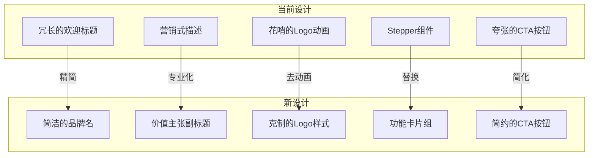

# SchoolGrid 初始总览页面重设计方案

> 设计风格：专业简约（Notion/Linear 风格）
> 最后更新：2026-03-21

---

## 一、当前问题分析

### 1.1 文案问题
- **原标题**："欢迎来到 SchoolGrid 智能排课系统"
  - 问题：过于冗长，"欢迎来到"是无效信息
- **原描述**："仅需四个简单步骤，即可生成全校最优课表"
  - 问题：营销话术感强，"最优"缺乏可信度

### 1.2 视觉问题
- Logo 动画效果过于花哨（旋转 hover）
- 背景装饰元素（800px 模糊圆）过于突兀
- Stepper 组件在空白状态下显得空洞
- CTA 按钮样式过于夸张（多重阴影 + hover 动画）

---

## 二、设计策略

### 2.1 核心价值主张
**"规则驱动的智能排课"**

SchoolGrid 的核心差异化：
- Master & Delta 架构（基准表 + 变动集）
- 多维度规则引擎（学科/教师/时间约束）
- 三级优先级调课策略

### 2.2 文案策略

| 元素 | 原文案 | 新文案 | 理由 |
|------|--------|--------|------|
| 主标题 | 欢迎来到 SchoolGrid 智能排课系统 | **SchoolGrid** | 品牌名即标题，简洁有力 |
| 副标题 | 仅需四个简单步骤... | **规则驱动的智能排课** | 突出核心价值 |
| 描述 | - | 导入数据，配置规则，一键生成全校课表 | 具体行动指引 |
| CTA | 开始第一步：导入数据 | **开始使用** | 简洁直接 |

### 2.3 视觉策略

**Notion/Linear 风格特征**：
- 大量留白，内容居中
- 精致的排版层次
- 克制的色彩使用
- 微妙的交互反馈
- 无多余装饰元素

---

## 三、新设计方案

### 3.1 页面布局

```
┌────────────────────────────────────────────────────────────┐
│                                                            │
│                                                            │
│                      [Header 导航]                         │
│                                                            │
├────────────────────────────────────────────────────────────┤
│                                                            │
│                                                            │
│                                                            │
│                         ┌───┐                              │
│                         │ S │  ← Logo (48x48)              │
│                         └───┘                              │
│                                                            │
│                    SchoolGrid                              │
│              规则驱动的智能排课                              │
│                                                            │
│         导入数据，配置规则，一键生成全校课表                    │
│                                                            │
│                                                            │
│                    ┌─────────────┐                         │
│                    │  开始使用   │  ← Primary CTA          │
│                    └─────────────┘                         │
│                                                            │
│                                                            │
│    ┌─────────┐  ┌─────────┐  ┌─────────┐  ┌─────────┐     │
│    │  导入   │  │  规则   │  │  排课   │  │  微调   │     │
│    │  数据   │  │  配置   │  │  生成   │  │  导出   │     │
│    └─────────┘  └─────────┘  └─────────┘  └─────────┘     │
│                                                            │
│                                                            │
└────────────────────────────────────────────────────────────┘
```

### 3.2 组件设计

#### Logo 区域
```tsx
// 简洁的 Logo，无花哨动画
<div className="w-12 h-12 rounded-xl bg-[var(--color-primary)] 
                flex items-center justify-center">
  <span className="text-white font-serif font-bold text-xl">S</span>
</div>
```

#### 标题层次
```tsx
// 主标题 - 品牌名
<h1 className="font-serif text-4xl font-semibold text-[var(--color-text-primary)]">
  SchoolGrid
</h1>

// 副标题 - 价值主张
<p className="text-xl text-[var(--color-text-secondary)] mt-2">
  规则驱动的智能排课
</p>

// 描述 - 行动指引
<p className="text-base text-[var(--color-text-muted)] mt-4">
  导入数据，配置规则，一键生成全校课表
</p>
```

#### CTA 按钮
```tsx
// 简洁的 Primary 按钮，Linear 风格
<button className="px-6 py-3 bg-[var(--color-primary)] text-white 
                   rounded-lg font-medium text-base
                   hover:bg-[var(--color-primary-dark)] 
                   transition-colors duration-200">
  开始使用
</button>
```

#### 流程卡片组
```tsx
// 四个简洁的功能卡片，水平排列
const steps = [
  { icon: '📥', title: '导入数据', desc: '上传 Excel 文件' },
  { icon: '⚙️', title: '配置规则', desc: '设置排课约束' },
  { icon: '⚡', title: '生成课表', desc: '智能算法排课' },
  { icon: '📋', title: '微调导出', desc: '调整并导出' },
]
```

### 3.3 色彩应用

| 元素 | 颜色 | 用途 |
|------|------|------|
| Logo 背景 | `--color-primary` (#4f6d8a) | 品牌识别 |
| 主标题 | `--color-text-primary` (#2d3142) | 视觉焦点 |
| 副标题 | `--color-text-secondary` (#5c6378) | 价值传达 |
| 描述文字 | `--color-text-muted` (#8b9ab0) | 辅助信息 |
| CTA 按钮 | `--color-primary` → hover `--color-primary-dark` | 行动引导 |
| 卡片背景 | `white` + `--color-border-light` | 内容承载 |

### 3.4 间距规范

```
垂直间距（从上到下）：
- Logo margin-bottom: 24px
- 主标题 margin-bottom: 8px
- 副标题 margin-bottom: 16px
- 描述 margin-bottom: 32px
- CTA 按钮 margin-bottom: 48px
- 流程卡片区域 padding-top: 0

水平布局：
- 内容区 max-width: 480px（居中）
- 流程卡片 max-width: 800px（居中）
- 卡片间距 gap: 16px
```

### 3.5 动画效果

**入场动画**（保持克制）：
```css
/* 整体淡入 */
.animate-fade-in {
  animation: fadeIn 300ms ease-out;
}

/* 可选：标题轻微上移 */
@keyframes slideUp {
  from {
    opacity: 0;
    transform: translateY(8px);
  }
  to {
    opacity: 1;
    transform: translateY(0);
  }
}
```

**交互反馈**：
- 按钮 hover：背景色加深，无位移
- 卡片 hover：轻微阴影提升
- 无过度动画

---

## 四、代码实现要点

### 4.1 移除的元素
- 背景装饰圆（800px blur gradient）
- Logo 旋转动画
- Stepper 组件（空白状态下显示）
- 夸张的按钮阴影和位移动画

### 4.2 新增的元素
- 四个功能卡片组（替代 Stepper 展示流程）
- 更清晰的文案层次

### 4.3 保留的元素
- Logo 基础样式
- 整体居中布局
- 淡入动画

---

## 五、响应式考虑

| 断点 | 布局调整 |
|------|----------|
| >= 768px | 卡片水平排列 4 列 |
| < 768px | 卡片 2x2 网格 |
| < 480px | 卡片垂直堆叠 |

---

## 六、Mermaid 流程图



---

## 七、实施清单

- [ ] 更新主标题文案为 "SchoolGrid"
- [ ] 添加副标题 "规则驱动的智能排课"
- [ ] 更新描述文案
- [ ] 简化 CTA 按钮文案和样式
- [ ] 移除背景装饰元素
- [ ] 移除 Logo 旋转动画
- [ ] 创建功能卡片组件替代 Stepper
- [ ] 调整间距和排版
- [ ] 添加响应式支持

---

## 八、效果对比

### Before
```
┌─────────────────────────────────────┐
│         (大模糊背景圆)               │
│                                     │
│         [旋转S Logo]                │
│                                     │
│   欢迎来到 SchoolGrid 智能排课系统    │
│                                     │
│  仅需四个简单步骤，即可生成全校最优课表 │
│                                     │
│   ┌─────────────────────────────┐   │
│   │      Stepper 组件           │   │
│   └─────────────────────────────┘   │
│                                     │
│  [📥 开始第一步：导入数据 ➡️]        │
│                                     │
└─────────────────────────────────────┘
```

### After
```
┌─────────────────────────────┐
│                             │
│          ┌───┐              │
│          │ S │              │
│          └───┘              │
│                             │
│       SchoolGrid            │
│    规则驱动的智能排课         │
│                             │
│ 导入数据，配置规则，一键生成   │
│       全校课表               │
│                             │
│      [ 开始使用 ]            │
│                             │
│  ┌───┐ ┌───┐ ┌───┐ ┌───┐   │
│  │   │ │   │ │   │ │   │   │
│  └───┘ └───┘ └───┘ └───┘   │
│                             │
└─────────────────────────────┘
```

---

## 九、总结

本设计方案遵循 Notion/Linear 的专业简约风格，通过以下改进提升初始页面的品质感：

1. **文案精简**：去除无效信息，突出核心价值
2. **视觉克制**：移除多余装饰，专注内容本身
3. **层次清晰**：品牌 → 价值 → 行动 → 流程，递进式信息架构
4. **交互适度**：保留必要反馈，避免过度动画

最终目标是让用户在第一时间理解产品定位，并自然地开始使用流程。
