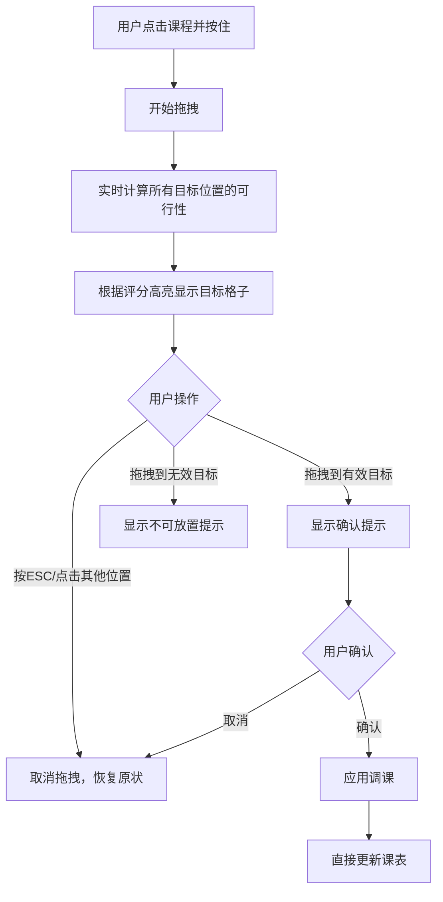
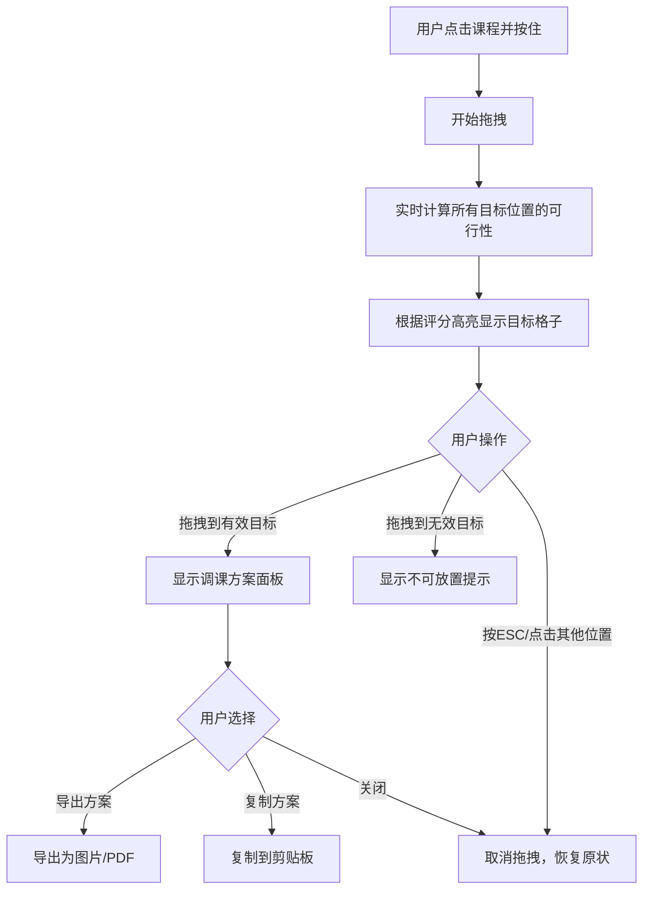

# 拖拽调课模式设计方案

## 1. 概述

将现有的点击触发调课模式改为直接拖拽交互，在拖拽过程中实时计算并显示调课建议，提供更直观的用户体验。

### 1.1 双模式支持

系统支持两种使用场景：

| 模式 | 场景 | 操作结果 |
|------|------|----------|
| **编辑模式** | 学期初排课 | 拖拽后直接更新课表 |
| **建议模式** | 学期中临时调课 | 拖拽后生成调课方案，不修改课表 |

用户可通过工具栏切换模式。

## 2. 交互流程

### 2.1 编辑模式（学期初排课）



### 2.2 建议模式（学期中临时调课）



### 2.3 模式切换

在课表工具栏添加模式切换组件：

```
┌─────────────────────────────────────────────────────────────┐
│  课表管理                                                   │
│                    [✏️ 编辑模式] [💡 建议模式]              │
├─────────────────────────────────────────────────────────────┤
```

## 3. 视觉反馈系统

### 3.1 目标格子高亮规则

根据调课优先级和评分，使用不同的视觉表现：

| 优先级 | 颜色 | 边框 | 说明 |
|--------|------|------|------|
| P0-同日互换 | `#10b981` 绿色 | 3px solid | 最优选择，学生影响最小 |
| P1-跨日互换 | `#3b82f6` 蓝色 | 2px solid | 次优选择 |
| P2-代课 | `#f59e0b` 橙色 | 2px dashed | 可接受，需要同科教师 |
| 不可行 | `#ef4444` 红色 | 2px dotted | 存在硬性约束冲突 |
| 空白格子 | `#9ca3af` 灰色 | 1px dashed | 可放置但无互换 |

### 3.2 拖拽中的视觉状态

```
┌─────────────────────────────────────────────────────────────┐
│                     拖拽中的课表界面                          │
├─────────────────────────────────────────────────────────────┤
│                                                             │
│   ┌─────────┐                                               │
│   │ 数学    │ ← 被拖拽的课程（半透明，跟随鼠标）              │
│   │ 张老师  │                                               │
│   └─────────┘                                               │
│                                                             │
│   ┌─────────┐  ┌─────────┐  ┌─────────┐  ┌─────────┐       │
│   │ 语文    │  │         │  │ 英语    │  │         │       │
│   │ 李老师  │  │         │  │ 王老师  │  │         │       │
│   └─────────┘  └─────────┘  └─────────┘  └─────────┘       │
│   ↑ P0绿色    ↑ 灰色空格    ↑ P1蓝色      ↑ 红色不可行       │
│   评分:95      评分:60      评分:80       冲突:教师占用      │
│                                                             │
└─────────────────────────────────────────────────────────────┘
```

### 3.3 悬浮提示信息

当鼠标悬停在高亮格子上时，显示详细信息：

```
┌──────────────────────────────────┐
│ 🔄 同日互换                       │
│ ─────────────────────────────── │
│ 目标: 第3节 语文课               │
│ 影响: 无冲突                     │
│ 评分: 95分                       │
│ ─────────────────────────────── │
│ 💡 推荐指数: ⭐⭐⭐⭐⭐            │
└──────────────────────────────────┘
```

### 3.4 建议模式-调课方案面板

在建议模式下，拖拽完成后显示调课方案面板（不修改课表）：

```
┌──────────────────────────────────────────┐
│ 📋 调课方案                         [✕]  │
├──────────────────────────────────────────┤
│                                          │
│  原课程位置          →      目标位置     │
│  ┌──────────┐              ┌──────────┐ │
│  │ 周二第3节│      →      │ 周三第5节│ │
│  │ 数学     │              │ 数学     │ │
│  │ 张老师   │              │ 张老师   │ │
│  └──────────┘              └──────────┘ │
│                                          │
├──────────────────────────────────────────┤
│ 📊 方案评估                              │
│                                          │
│  优先级: P1-跨日互换                     │
│  综合评分: 85分                          │
│  受影响学生: 45人                        │
│  约束冲突: 无                            │
│                                          │
├──────────────────────────────────────────┤
│ 💡 调课建议                              │
│  此方案将数学课从周二移至周三，          │
│  建议提前通知学生调整学习计划。          │
├──────────────────────────────────────────┤
│                                          │
│  [📷 导出图片] [📋 复制方案] [关闭]     │
└──────────────────────────────────────────┘
```

**导出功能说明**：
- **导出图片**：将方案面板导出为PNG图片，方便分享
- **复制方案**：将方案文字复制到剪贴板，可粘贴到微信/钉钉等

## 4. 技术实现方案

### 4.1 技术选型

推荐使用 **@dnd-kit** 库，原因：

1. **现代化设计**：支持 React 18+，TypeScript 友好
2. **无障碍支持**：内置键盘操作支持
3. **高性能**：不依赖 DOM 操作，使用 CSS transform
4. **灵活性强**：支持复杂拖拽场景
5. **轻量级**：核心包体积小

替代方案：
- HTML5原生 Drag API：需要更多手动处理，跨浏览器兼容性问题
- react-beautiful-dnd：功能强大但主要面向列表排序场景

### 4.2 核心组件结构

```
src/components/Schedule/
├── ScheduleGrid.tsx          # 主课表容器
├── ScheduleCell.tsx          # 单元格组件（新增）
├── DraggableCourse.tsx       # 可拖拽课程组件（新增）
├── DropTarget.tsx            # 放置目标组件（新增）
└── hooks/
    ├── useDragAdjustment.ts  # 拖拽调课逻辑Hook（新增）
    └── useAdjustmentPreview.ts # 实时预览计算Hook（新增）
```

### 4.3 状态管理变更

在 `scheduleStore.ts` 中添加新的状态：

```typescript
// 新增：调课模式类型
type AdjustmentModeType = 'edit' | 'suggest'  // 编辑模式 | 建议模式

interface DragAdjustmentState {
  // 调课模式
  adjustmentModeType: AdjustmentModeType
  
  // 拖拽状态
  isDragging: boolean
  draggedCell: ScheduleCell | null
  
  // 实时计算的放置建议
  dropTargets: Map<string, DropTargetInfo>
  
  // 当前悬停的目标
  hoveredTarget: string | null
  
  // 预览模式（拖拽过程中临时显示）
  previewMode: boolean
  previewSchedule: SchoolSchedule | null
  
  // 建议模式下的方案
  currentProposal: AdjustmentProposal | null
}

interface DropTargetInfo {
  cellId: string
  dayOfWeek: number
  period: number
  priority: AdjustmentPriority | null
  score: number
  isValid: boolean
  violations: string[]
  operations: ScheduleOperation[]
}

// 新增：调课方案（建议模式使用）
interface AdjustmentProposal {
  id: string
  originalCell: ScheduleCell
  targetSlot: { dayOfWeek: number; period: number }
  targetCell: ScheduleCell | null  // null表示空白格子
  priority: AdjustmentPriority
  score: number
  violations: string[]
  operations: ScheduleOperation[]
  createdAt: Date
}
```

## 5. 实现步骤

### Phase 1: 基础拖拽功能

1. 安装 @dnd-kit 依赖
2. 创建 `DraggableCourse` 组件包装现有课程
3. 创建 `DropTarget` 组件处理放置逻辑
4. 在 `ScheduleGrid` 中集成 DndContext

### Phase 2: 实时建议计算

1. 实现 `useAdjustmentPreview` Hook
2. 在拖拽开始时预计算所有目标位置的可行性
3. 根据计算结果更新 `dropTargets` 状态

### Phase 3: 视觉反馈

1. 实现目标格子高亮样式
2. 添加悬浮提示组件
3. 实现拖拽预览（半透明跟随）
4. 添加放置确认动画

### Phase 4: 双模式实现

1. 添加模式切换状态 `adjustmentModeType`
2. 在工具栏添加模式切换按钮
3. 实现编辑模式的直接更新逻辑
4. 创建建议模式的调课方案面板组件
5. 实现导出图片功能（使用 html2canvas）
6. 实现复制方案功能

### Phase 5: 完善交互

1. 添加键盘支持（ESC取消）
2. 实现撤销功能
3. 添加操作成功/失败提示
4. 优化性能（防抖、虚拟化）

## 6. 性能优化

### 6.1 计算优化

```typescript
// 使用 useMemo 缓存计算结果
const dropTargets = useMemo(() => {
  if (!draggedCell) return new Map()
  return calculateAllDropTargets(draggedCell, schedule, teachers)
}, [draggedCell, schedule, teachers])

// 使用 Web Worker 处理大量计算（可选）
// 将调课算法移到 Worker 中执行
```

### 6.2 渲染优化

- 使用 `React.memo` 包装 `ScheduleCell` 组件
- 只重新渲染受影响的格子
- 使用 CSS transform 而非重新渲染实现拖拽动画

## 7. 用户操作流程

### 7.1 基本调课操作

1. **开始拖拽**：点击课程并按住鼠标
2. **查看建议**：拖拽过程中，所有可能的目标位置会高亮显示
3. **选择目标**：将课程拖到想要的位置
4. **确认操作**：松开鼠标后显示确认对话框
5. **完成/取消**：确认应用或取消操作

### 7.2 取消拖拽的方式

- 按 `ESC` 键
- 点击课表外的任意位置
- 将课程拖回原位置

### 7.3 键盘支持

- `Tab`：在高亮的目标格子间切换
- `Enter`：确认放置
- `Escape`：取消拖拽

## 8. 错误处理

| 场景 | 处理方式 |
|------|----------|
| 教师时间冲突 | 红色高亮，显示冲突原因 |
| 学科禁排时段 | 红色高亮，显示禁排规则 |
| 无可用替换 | 灰色显示，提示无建议 |
| 网络/计算错误 | 显示错误提示，允许重试 |

## 9. 后续扩展

- 支持批量拖拽（多节课同时调整）
- 支持跨班级拖拽（需要额外权限）
- 拖拽历史记录和回滚
- 移动端触摸支持
